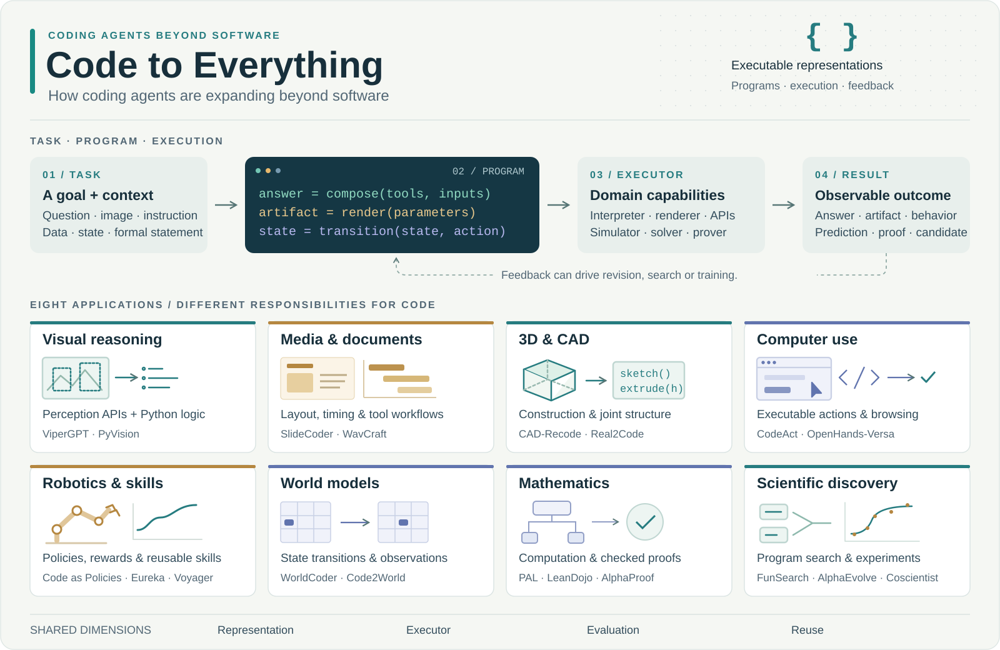

<!-- Generated by scripts/build.py; edit data/*.json and scripts/build.py. -->

# Code to Everything

**How Coding Agents Are Expanding Beyond Software**

[English](README.md) · [中文](README.zh-CN.md)

 

代码智能体在视觉推理、内容创作、机器人、形式证明与科学发现中的应用。收录方法、基准与相关基础工作，整理程序表示、系统机制及实验结果。

**167 篇文献** · 更新于 2026-09-28 · [方法与实验](docs/paper-notes.zh-CN.md) · [跨方法比较](docs/evidence.zh-CN.md)

[BibTeX](references.bib) · [RIS](references.ris) · [CSV](data/papers.csv) · [JSON](data/papers.json)

## 领域

| 领域 | 任务 | 文献数 |
|---|---|---:|
| [视觉推理与图形](#vision) | 回答视觉问题，生成可编辑图形。 | 25 |
| [音频、视频与文档](#media) | 通过程序组织声音、动画和文档布局。 | 10 |
| [3D、CAD 与场景重建](#spatial) | 恢复建模步骤、关节结构与场景编辑操作。 | 17 |
| [电脑操作与数字工作流](#digital) | 组合工具、浏览与电脑操作，完成数字任务。 | 12 |
| [具身智能与机器人](#robotics) | 编写策略、积累技能，或生成训练信号。 | 20 |
| [世界模型与环境构建](#worlds) | 预测状态转移、渲染观察，或维护持久状态。 | 10 |
| [数学与形式化证明](#math) | 计算答案、搜索形式证明，探索数学构造。 | 21 |
| [科学与算法发现](#science) | 搜索算法与方程，开展分析和物理实验。 | 26 |
| [共同基础、工具与技能](#foundations) | 梳理程序合成、交互循环与经验复用。 | 16 |
| [相关综述](#surveys) | 代码模型、执行框架与领域应用的研究综述。 | 10 |

## 文献与方法

★ 标记在程序表示、执行方式或学习机制上形成代表性进展的工作，具体贡献列于论文名下。各子领域按首次公开日期倒序排列。

### 视觉推理与图形

视觉程序有两种主要产物：推理步骤与可编辑图形。NS-VQA 使用符号操作，VisProg 组合固定视觉模块，ViperGPT 将模块接入 Python 控制流，PyVision 进一步在运行中编写图像处理工具。图表生成则以渲染图为反馈，评价从程序执行扩展到数据表达与版面质量。

#### 通过程序进行视觉推理

| 首次公开 | 论文 | 方法与特点 | 资源 |
|---|---|---|---|
| 2025-12 | **CodeVision** · 方法 Thinking with Programming Vision: Towards a Unified View for Thinking with Images | 提出通过动态代码工具改善图像变换和扰动下视觉推理的CodeVision框架。 | [Paper](https://arxiv.org/abs/2512.03746) |
| 2025-11 | **CodeV** · 方法 CodeV: Code with Images for Faithful Visual Reasoning via Tool-Aware Policy Optimization | 借助图像工具与策略优化增强代码驱动视觉推理。 | [Paper](https://arxiv.org/abs/2511.19661) |
| 2025-07 | **PyVision** · 方法 PyVision: Agentic Vision with Dynamic Tooling | 在多轮视觉推理中即时编写 Python 工具，调用 OpenCV、Pillow 等通用库完成裁剪、增强、几何测量或辅助标注。文本与处理后的图像返回上下文，跨轮状态支持连续处理。 | [Paper](https://arxiv.org/abs/2507.07998) · [分析](docs/paper-notes.zh-CN.md#pyvision) |
| 2025-06 | **ChartReasoner** · 方法 ChartReasoner: Code-Driven Modality Bridging for Long-Chain Reasoning in Chart Question Answering | 通过代码连接图表理解与长链推理。 | [Paper](https://arxiv.org/abs/2506.10116) |
| 2023-03 | **ViperGPT** · 方法 ViperGPT: Visual Inference via Python Execution for Reasoning ★ Python控制流程连接视觉工具与推理。 | 将视觉问题写成 Python：检测与属性判断由视觉 API 完成，筛选、排序、计数和条件分支由解释器执行。仅提供 API 签名与文档即可组合工具，无需为每项下游任务重新训练。 | [Paper](https://arxiv.org/abs/2303.08128) · [Code](https://github.com/cvlab-columbia/viper) · [Project](https://viper.cs.columbia.edu/) · [分析](docs/paper-notes.zh-CN.md#vipergpt) |
| 2022-11 | **VisProg** · 方法 Visual Programming: Compositional visual reasoning without training ★ 视觉任务被拆成可执行的专用模块组合。 | 将视觉请求拆成预定义模块的执行序列，用同一种程序表示完成推理、识别和图像编辑。 | [Paper](https://arxiv.org/abs/2211.11559) · [分析](docs/paper-notes.zh-CN.md#visprog) |
| 2018-10-04 | **NSVQA** · 基础 Neural-Symbolic VQA: Disentangling Reasoning from Vision and Language Understanding ★ LLM之前，程序已将感知与显式推理连接起来。 | 将视觉感知与符号程序执行分开，是LLM之前程序化视觉推理的重要前史。 | [Paper](https://arxiv.org/abs/1810.02338) · [Code](https://github.com/kexinyi/ns-vqa) · [Project](http://nsvqa.csail.mit.edu) |

#### 图表、矢量图与交互内容

| 首次公开 | 论文 | 方法与特点 | 资源 |
|---|---|---|---|
| 2026-04 | **OmniDiagram** · 方法 OmniDiagram: Advancing Unified Diagram Code Generation via Visual Interrogation Reward | 以视觉问答式奖励推动统一图示代码生成。 | [Paper](https://arxiv.org/abs/2604.05514) |
| 2025-08 | **ChartMaster** · 方法 ChartMaster: Advancing Chart-to-Code Generation with Real-World Charts and Chart Similarity Reinforcement Learning | 结合真实图表与图表相似性奖励训练代码生成。 | [Paper](https://arxiv.org/abs/2508.17608) |
| 2025-01 | **ChartCoder** · 方法 ChartCoder: Advancing Multimodal Large Language Model for Chart-to-Code Generation | 训练面向图表到代码的多模态模型。 | [Paper](https://arxiv.org/abs/2501.06598) |
| 2024-08 | **SymbolicGraphics** · 基准 Can Large Language Models Understand Symbolic Graphics Programs? | 研究语言模型理解符号图形程序的能力。 | [Paper](https://arxiv.org/abs/2408.08313) |
| 2024-02 | **MatPlotAgent** · 方法 MatPlotAgent: Method and Evaluation for LLM-Based Agentic Scientific Data Visualization | 先扩展绘图需求，再生成和调试代码；视觉模块检查渲染草图并把修改意见反馈给代码模块。运行错误与视觉缺陷使用独立反馈，100题 MatPlotBench 按参考图评价最终图表。 | [Paper](https://arxiv.org/abs/2402.11453) · [分析](docs/paper-notes.zh-CN.md#matplotagent) |
| 2023-10 | **AutomaTikZ** · 方法 AutomaTikZ: Text-Guided Synthesis of Scientific Vector Graphics with TikZ | 从文字生成可编译的TikZ科学矢量图。 | [Paper](https://arxiv.org/abs/2310.00367) · [Code](https://github.com/potamides/AutomaTikZ) |
| 2023-05 | **VPGen** · 方法 Visual Programming for Text-to-Image Generation and Evaluation | 用视觉程序组织文本到图像生成及其评价。 | [Paper](https://arxiv.org/abs/2305.15328) |

#### 多模态代码模型与基准

| 首次公开 | 论文 | 方法与特点 | 资源 |
|---|---|---|---|
| 2025-11 | **VCode** · 基准 VCode: a Multimodal Coding Benchmark with SVG as Symbolic Visual Representation | 以SVG符号视觉表示评价多模态编程。 | [Paper](https://arxiv.org/abs/2511.02778) · [Code](https://github.com/CSU-JPG/VCode) |
| 2025-11 | **VinciCoder** · 方法 VinciCoder: Unifying Multimodal Code Generation via Coarse-to-fine Visual Reinforcement Learning | 通过由粗到细的视觉强化学习统一多模态代码生成。 | [Paper](https://arxiv.org/abs/2511.00391) |
| 2025-10 | **VisCoder2** · 方法 VisCoder2: Building Multi-Language Visualization Coding Agents | 构建多语言可视化代码agent。 | [Paper](https://arxiv.org/abs/2510.23642) |
| 2025-10 | **JanusCoder** · 方法 JanusCoder: Towards a Foundational Visual-Programmatic Interface for Code Intelligence ★ 联合视觉程序训练让跨任务收益与干扰可以直接检查。 | 把文本与视觉程序任务放进同一个代码模型训练，并通过数据移除实验观察任务间的收益与干扰。 | [Paper](https://arxiv.org/abs/2510.23538) · [Code](https://github.com/InternLM/JanusCoder) · [分析](docs/paper-notes.zh-CN.md#januscoder) |
| 2025-10 | **InteractScience** · 基准 InteractScience: Programmatic and Visually-Grounded Evaluation of Interactive Scientific Demonstration Code Generation | 评价交互科学演示代码的程序功能和视觉呈现。 | [Paper](https://arxiv.org/abs/2510.09724) |
| 2025-08 | **VisCodex** · 方法 VisCodex: Unified Multimodal Code Generation via Merging Vision and Coding Models | 结合视觉与代码模型以统一多模态代码生成。 | [Paper](https://arxiv.org/abs/2508.09945) |
| 2025-07 | **ArtifactsBench** · 基准 ArtifactsBench: Bridging the Visual-Interactive Gap in LLM Code Generation Evaluation | 评价代码生成产物的视觉与交互表现。 | [Paper](https://arxiv.org/abs/2507.04952) |
| 2024-06 | **ChartMimic** · 基准 ChartMimic: Evaluating LMM's Cross-Modal Reasoning Capability via Chart-to-Code Generation | 从参考科学图表生成重现图表的代码，并评价结果。 | [Paper](https://arxiv.org/abs/2406.09961) · [Code](https://github.com/ChartMimic/ChartMimic) |
| 2024-04 | **MMCode** · 基准 MMCode: Benchmarking Multimodal Large Language Models for Code Generation with Visually Rich Programming Problems | 评价带有丰富视觉信息的编程题求解。 | [Paper](https://arxiv.org/abs/2404.09486) |

#### 感知与工具编排参照

| 首次公开 | 论文 | 方法与特点 | 资源 |
|---|---|---|---|
| 2023-03 | **HuggingGPT** · 参照 HuggingGPT: Solving AI Tasks with ChatGPT and its Friends in Hugging Face | 由语言模型规划并调用多个专业模型解决复合任务。 | [Paper](https://arxiv.org/abs/2303.17580) |
| 2023-01 | **BLIP2** · 参照 BLIP-2: Bootstrapping Language-Image Pre-training with Frozen Image Encoders and Large Language Models | 连接视觉编码器与语言模型以支持视觉语言任务。 | [Paper](https://arxiv.org/abs/2301.12597) |

### 音频、视频与文档

多媒体生成中的代码负责时间组织、资产组合与版面构造。WavJourney 将音频事件脚本编译成混音程序；WavCraft 直接编排音频工具。SlideCoder 从参考设计重建页面，Paper2Poster 则从论文中选择内容并分配版面。两者分别对应设计还原与信息压缩，输入条件和评价目标不同。

#### 音频生成与编辑

| 首次公开 | 论文 | 方法与特点 | 资源 |
|---|---|---|---|
| 2024-10 | **AudioAgent** · 参照 Audio-Agent: Leveraging LLMs For Audio Generation, Editing and Composition | 文本分支生成JSON函数调用来组织音频事件；视频分支预测HuBERT语义token并调用Auffusion。 | [Paper](https://arxiv.org/abs/2410.03335) |
| 2024-03 | **WavCraft** · 方法 WavCraft: Audio Editing and Generation with Large Language Models | 先分析输入录音，再生成调用专用工具的程序，完成局部声音编辑和重新组合。 | [Paper](https://arxiv.org/abs/2403.09527) · [分析](docs/paper-notes.zh-CN.md#wavcraft) |
| 2023-07 | **WavJourney** · 方法 WavJourney: Compositional Audio Creation with Large Language Models | 将语音、音乐和音效写成 JSON 事件脚本，显式指定音量、时长及前后台关系。编译器计算时序并调用专用生成模型、拼接与混音函数，语言模型负责叙事结构。 | [Paper](https://arxiv.org/abs/2307.14335) · [Code](https://github.com/Audio-AGI/WavJourney) · [分析](docs/paper-notes.zh-CN.md#wavjourney) |

#### 视频编辑与程序动画

| 首次公开 | 论文 | 方法与特点 | 资源 |
|---|---|---|---|
| 2025-10 | **Paper2Video** · 方法 Paper2Video: Automatic Video Generation from Scientific Papers | PaperTalker从论文LaTeX项目生成Beamer、讲稿与展示视频；编译反馈修复幻灯片，语音和人物视频由专用模型完成。 | [Paper](https://arxiv.org/abs/2510.05096) |
| 2025-10 | **Code2Video** · 方法 Code2Video: A Code-centric Paradigm for Educational Video Generation | 将教学主题拆成分镜，生成 Manim 场景代码，再根据视觉评论修改动画。 | [Paper](https://arxiv.org/abs/2510.01174) · [分析](docs/paper-notes.zh-CN.md#code2video) |
| 2024-02 | **LAVE** · 方法 LAVE: LLM-Powered Agent Assistance and Language Augmentation for Video Editing | 以语言增强和agent辅助支持视频编辑工作流。 | [Paper](https://arxiv.org/abs/2402.10294) |

#### 幻灯片、海报与文档程序

| 首次公开 | 论文 | 方法与特点 | 资源 |
|---|---|---|---|
| 2025-09 | **Table2LaTeXRL** · 方法 Table2LaTeX-RL: High-Fidelity LaTeX Code Generation from Table Images via Reinforced Multimodal Language Models | 从表格图像生成 LaTeX，把编译、渲染相似度和表格结构用于强化学习奖励。 | [Paper](https://arxiv.org/abs/2509.17589) · [分析](docs/paper-notes.zh-CN.md#table2latexrl) |
| 2025-06 | **SlideCoder** · 方法 SlideCoder: Layout-aware RAG-enhanced Hierarchical Slide Generation from Design | 用颜色梯度递归分割参考页，逐块描述、生成代码后按全局布局组装；分层检索先匹配图形类型，再补充操作 API。输入包含设计图与独立图像资产，输出为可编辑幻灯片。 | [Paper](https://arxiv.org/abs/2506.07964) · [分析](docs/paper-notes.zh-CN.md#slidecoder) |
| 2025-05 | **Paper2Poster** · 方法 Paper2Poster: Towards Multimodal Poster Automation from Scientific Papers | 从论文提取文字与图像资产，按语义匹配后用二叉树布局分配面板；模型压缩面板文字，固定 python-pptx 生成器负责绘制。局部放大评审检查溢出、留白与信息表达。 | [Paper](https://arxiv.org/abs/2505.21497) · [Code](https://github.com/Paper2Poster/Paper2Poster) · [分析](docs/paper-notes.zh-CN.md#paper2poster) |
| 2024-12 | **BigDocs** · 基准 BigDocs: An Open Dataset for Training Multimodal Models on Document and Code Tasks | 提供包含文档和代码任务的多模态训练数据。 | [Paper](https://arxiv.org/abs/2412.04626) |

### 3D、CAD 与场景重建

三维程序分别描述构造历史、运动结构和场景属性。CAD-Recode 将点云映射为草图—拉伸程序；Real2Code 将部件包围盒映射为关节结构；BlenderAlchemy 搜索已有场景的材质、几何与灯光修改。几何相似度衡量重建表面，关节误差衡量运动结构，渲染评价衡量编辑效果。

#### 将对象重建为程序

| 首次公开 | 论文 | 方法与特点 | 资源 |
|---|---|---|---|
| 2025-08 | **MeshCoder** · 方法 MeshCoder: LLM-Powered Structured Mesh Code Generation from Point Clouds | 从点云生成结构化网格程序。 | [Paper](https://arxiv.org/abs/2508.14879) |
| 2024-12 | **CADRecode** · 方法 CAD-Recode: Reverse Engineering CAD Code from Point Clouds ★ 点云被转化为可编辑的构造程序。 | 将点云采样为256点，经傅里叶位置编码和线性投影接入 Qwen2-1.5B，生成 CadQuery 草图—拉伸代码。百万级合成 CAD 程序用于训练；推理时执行10个候选，以 Chamfer 距离筛选。 | [Paper](https://arxiv.org/abs/2412.14042) · [分析](docs/paper-notes.zh-CN.md#cadrecode) |
| 2024-06 | **Real2Code** · 方法 Real2Code: Reconstruct Articulated Objects via Code Generation ★ 重建输出可执行的物体运动结构。 | 先分割并补全部件几何，再把有向包围盒交给微调 CodeLlama。关节轴与位置表示为包围盒轴、边的索引，将连续回归改为离散选择，生成可在 MuJoCo 中执行的物体结构。 | [Paper](https://arxiv.org/abs/2406.08474) · [Code](https://github.com/MandiZhao/real2code) · [分析](docs/paper-notes.zh-CN.md#real2code) |

#### 参数化CAD与检查

| 首次公开 | 论文 | 方法与特点 | 资源 |
|---|---|---|---|
| 2025-12 | **ReCAD** · 方法 ReCAD: Reinforcement Learning Enhanced Parametric CAD Model Generation with Vision-Language Models | 以强化学习增强参数化CAD生成。 | [Paper](https://arxiv.org/abs/2512.06328) |
| 2025-08 | **CADJudge** · 基准 CAD-Judge: Toward Efficient Morphological Grading and Verification for Text-to-CAD Generation | 评价和验证文本生成CAD的形态质量。 | [Paper](https://arxiv.org/abs/2508.04002) |
| 2025-05 | **CADReview** · 方法 CADReview: Automatically Reviewing CAD Programs with Error Detection and Correction | 自动检测并修正CAD程序错误。 | [Paper](https://arxiv.org/abs/2505.22304) |
| 2025-05 | **CADCoderText** · 方法 CAD-Coder: Text-to-CAD Generation with Chain-of-Thought and Geometric Reward | 结合思维链和几何奖励从文本生成CAD代码。 | [Paper](https://arxiv.org/abs/2505.19713) |
| 2025-05 | **CADCoderVision** · 方法 CAD-Coder: An Open-Source Vision-Language Model for Computer-Aided Design Code Generation | 开放面向CAD代码生成的视觉语言模型。 | [Paper](https://arxiv.org/abs/2505.14646) |
| 2025-01 | **VisualFeedbackCAD** · 方法 Text-to-CAD Generation Through Infusing Visual Feedback in Large Language Models | 将渲染后的视觉反馈引入文本到CAD生成。 | [Paper](https://arxiv.org/abs/2501.19054) |
| 2024-11 | **CADMLLM** · 方法 CAD-MLLM: Unifying Multimodality-Conditioned CAD Generation With MLLM | 统一多模态条件下的CAD生成。 | [Paper](https://arxiv.org/abs/2411.04954) |
| 2024-09 | **Text2CAD** · 方法 Text2CAD: Generating Sequential CAD Models from Beginner-to-Expert Level Text Prompts | 将不同详细程度的文本转换为顺序CAD建模表示。 | [Paper](https://arxiv.org/abs/2409.17106) |
| 2024-06 | **Query2CAD** · 方法 Query2CAD: Generating CAD models using natural language queries | 从自然语言查询生成CAD模型。 | [Paper](https://arxiv.org/abs/2406.00144) |
| 2021-05-20 | **DeepCAD** · 基础 DeepCAD: A Deep Generative Network for Computer-Aided Design Models | 以CAD操作序列表示和生成形状，而非只输出最终几何。 | [Paper](https://arxiv.org/abs/2105.09492) · [Code](https://github.com/ChrisWu1997/DeepCAD) · [Project](http://www.cs.columbia.edu/cg/deepcad/) |

#### 程序化形状与场景编辑

| 首次公开 | 论文 | 方法与特点 | 资源 |
|---|---|---|---|
| 2025-08-11 | **LL3M** · 方法 LL3M: Large Language 3D Modelers | 协调多个代码agent生成和改进可解释的Blender资产，支持文本与视觉反馈。 | [Paper](https://arxiv.org/abs/2508.08228) · [Project](https://threedle.github.io/ll3m) |
| 2024-04-26 | **BlenderAlchemy** · 方法 BlenderAlchemy: Editing 3D Graphics with Vision-Language Models | 将已有 Blender 场景拆成材质、几何或灯光脚本，交替搜索参数微调与结构修改。候选执行后渲染，视觉模型通过两两比较选择；当前最佳版本保留为候选，支持回退。 | [Paper](https://arxiv.org/abs/2404.17672) · [分析](docs/paper-notes.zh-CN.md#blenderalchemy) |
| 2024-03 | **SceneCraft** · 方法 SceneCraft: An LLM Agent for Synthesizing 3D Scene as Blender Code | 通过Blender代码合成三维场景。 | [Paper](https://arxiv.org/abs/2403.01248) |
| 2020-09-17 | **ShapeAssembly** · 基础 ShapeAssembly: Learning to Generate Programs for 3D Shape Structure Synthesis | 生成具有可编辑参数的层次化形状装配程序，属于LLM之前的程序表示研究。 | [Paper](https://arxiv.org/abs/2009.08026) · [Code](https://github.com/rkjones4/shapeAssembly) · [Project](https://rkjones4.github.io/shapeAssembly.html) |

### 电脑操作与数字工作流

代码动作把工具返回值保存在变量中，用循环、分支和函数组合后续操作。CodeAct 在同一模型下比较代码、JSON 与文本动作；OpenHands-Versa 将代码环境用于多类非软件任务。浏览器、操作系统和企业应用开放的接口不同，任务成功率取决于动作表示与环境权限的共同作用。

#### 可执行动作与通用框架

| 首次公开 | 论文 | 方法与特点 | 资源 |
|---|---|---|---|
| 2025-06 | **OpenHandsVersa** · 方法 Coding Agents with Multimodal Browsing are Generalist Problem Solvers ★ 同一代码agent框架被用于多类非软件任务评估。 | 为代码智能体加入多模态浏览能力，在软件、通用助理和企业工作流中测试同一框架。 | [Paper](https://arxiv.org/abs/2506.03011) · [分析](docs/paper-notes.zh-CN.md#openhandsversa) |
| 2024-11 | **MagenticOne** · 方法 Magentic-One: A Generalist Multi-Agent System for Solving Complex Tasks | 由多个角色协作处理网页、文件和代码任务。 | [Paper](https://arxiv.org/abs/2411.04468) |
| 2024-07 | **OpenHands** · 方法 OpenHands: An Open Platform for AI Software Developers as Generalist Agents | 提供代码编辑、执行和浏览等能力的开放agent平台。 | [Paper](https://arxiv.org/abs/2407.16741) · [Code](https://github.com/All-Hands-AI/OpenHands) |
| 2024-02 | **CodeAct** · 方法 Executable Code Actions Elicit Better LLM Agents ★ 动作表示本身成为可对照评估的设计选择。 | 用多轮 Python 程序作为动作：单次动作可循环调用多个工具，变量承接中间结果，执行输出与报错驱动修正。通过同模型的文本/JSON/代码对照，区分动作表示与模型能力。 | [Paper](https://arxiv.org/abs/2402.01030) · [Code](https://github.com/xingyaoww/code-act) · [分析](docs/paper-notes.zh-CN.md#codeact) |
| 2023-11 | **TaskWeaver** · 方法 TaskWeaver: A Code-First Agent Framework | 以代码为中心规划数据分析工作，调用插件并管理执行状态。 | [Paper](https://arxiv.org/abs/2311.17541) |

#### 浏览器与桌面交互

| 首次公开 | 论文 | 方法与特点 | 资源 |
|---|---|---|---|
| 2024-10 | **AgentS** · 参照 Agent S: An Open Agentic Framework that Uses Computers Like a Human | 通过屏幕交互与经验组织完成电脑任务。 | [Paper](https://arxiv.org/abs/2410.08164) |
| 2024-03 | **Cradle** · 方法 Cradle: Empowering Foundation Agents Towards General Computer Control | 通过屏幕观察与输入控制开展通用电脑任务。 | [Paper](https://arxiv.org/abs/2403.03186) |
| 2024-01 | **WebVoyager** · 参照 WebVoyager: Building an End-to-End Web Agent with Large Multimodal Models | 以多模态观察与网页交互完成在线任务。 | [Paper](https://arxiv.org/abs/2401.13919) · [Code](https://github.com/MinorJerry/WebVoyager) |
| 2023-07 | **WebAgent** · 方法 A Real-World WebAgent with Planning, Long Context Understanding, and Program Synthesis | 结合网页理解、任务规划与程序合成操作真实网站。 | [Paper](https://arxiv.org/abs/2307.12856) |

#### 数字任务评估

| 首次公开 | 论文 | 方法与特点 | 资源 |
|---|---|---|---|
| 2024-04 | **OSWorld** · 基准 OSWorld: Benchmarking Multimodal Agents for Open-Ended Tasks in Real Computer Environments | 评价多模态agent在真实电脑环境中完成跨应用任务。 | [Paper](https://arxiv.org/abs/2404.07972) |
| 2024-03 | **WorkArena** · 基准 WorkArena: How Capable Are Web Agents at Solving Common Knowledge Work Tasks? | 评价网页agent完成企业知识工作任务的能力。 | [Paper](https://arxiv.org/abs/2403.07718) |
| 2023-11 | **GAIA** · 基准 GAIA: a benchmark for General AI Assistants | 以信息检索、工具和多步推理任务评价通用助理。 | [Paper](https://arxiv.org/abs/2311.12983) |

### 具身智能与机器人

机器人程序介入控制与学习的不同环节：Code as Policies 组合控制 API，VoxPoser 构造空间价值图供规划器求解；Eureka 生成奖励，GenSim2 生成训练示范。Voyager 将成功程序积累为技能库。API 组合、奖励优化与经验复用因此对应不同的训练成本和泛化实验。

#### 策略、规划与机器人程序系统

| 首次公开 | 论文 | 方法与特点 | 资源 |
|---|---|---|---|
| 2026-09-25 | **RIVET** · 方法 Representation-Guided Generation and Integration of Executable Programs for Robot Manipulation | 围绕共享对象表示生成可协作的感知与规划程序，再复用到新的起止状态。 | [Paper](https://arxiv.org/abs/2609.31337) |
| 2026-09-16 | **M3PR1** · 方法 M$^3$P-R1: Reinforcement Learning for Large Language Model Guided Multi-Modal Motion Planning via MIP Code Generation | 生成调用求解器的Python模型，处理离散模式与连续运动耦合的规划问题。 | [Paper](https://arxiv.org/abs/2609.18669) |
| 2026-09-14 | **AutoHSI** · 方法 Auto-HSI: Personalized human control of a robot swarm on demand by using LLMs for online automatic code generation | 生成个性化状态机接口，让手势控制机器人群；保留操作者参与的任务设定。 | [Paper](https://arxiv.org/abs/2609.16346) |
| 2025-10 | **EmbodiedCoder** · 方法 EmbodiedCoder: Parameterized Embodied Mobile Manipulation via Modern Coding Model | 以Claude Sonnet 4生成几何拟合与参数化轨迹程序，结合专用感知与重建模块执行机器人任务。 | [Paper](https://arxiv.org/abs/2510.06207) |
| 2025-01 | **RoboticProgrammer** · 方法 Robotic Programmer: Video Instructed Policy Code Generation for Robotic Manipulation | RoboPro 用视频转代码数据训练模型，再根据观察和指令生成机器人策略，并测试 API 改名和重构后的适应。 | [Paper](https://arxiv.org/abs/2501.04268) · [分析](docs/paper-notes.zh-CN.md#roboticprogrammer) |
| 2024-02 | **RoboCodeX** · 方法 RoboCodeX: Multimodal Code Generation for Robotic Behavior Synthesis | 利用多模态输入合成机器人行为代码。 | [Paper](https://arxiv.org/abs/2402.16117) |
| 2024-02 | **RoboScript** · 方法 RoboScript: Code Generation for Free-Form Manipulation Tasks across Real and Simulation | 为仿真和真实操作任务生成程序。 | [Paper](https://arxiv.org/abs/2402.14623) |
| 2023-07 | **VoxPoser** · 方法 VoxPoser: Composable 3D Value Maps for Robotic Manipulation with Language Models ★ 生成的空间程序可以指导连续运动规划。 | 用程序把语言要求和视觉观察转换为三维价值图，再由规划器据此生成运动。 | [Paper](https://arxiv.org/abs/2307.05973) · [Code](https://github.com/huangwl18/VoxPoser) · [Project](https://voxposer.github.io) · [分析](docs/paper-notes.zh-CN.md#voxposer) |
| 2023-05-18 | **Instruct2Act** · 方法 Instruct2Act: Mapping Multi-modality Instructions to Robotic Actions with Large Language Model | 生成Python连接多模态指令、SAM/CLIP感知和机器人接口。 | [Paper](https://arxiv.org/abs/2305.11176) · [Code](https://github.com/OpenGVLab/Instruct2Act) |
| 2022-09-22 | **ProgPrompt** · 方法 ProgPrompt: Generating Situated Robot Task Plans using Large Language Models | 以程序式提示描述可用动作、对象和执行检查，生成符合场景的机器人计划。 | [Paper](https://arxiv.org/abs/2209.11302) · [Code](https://github.com/NVlabs/progprompt-vh) · [Project](http://progprompt.github.io) |
| 2022-09 | **CodeAsPolicies** · 方法 Code as Policies: Language Model Programs for Embodied Control ★ 语言模型在已有接口上编写层次化机器人策略。 | 将语言指令写成层次化 Python 策略，在已有感知和控制 API 上继续生成辅助函数。 | [Paper](https://arxiv.org/abs/2209.07753) · [Code](https://github.com/google-research/google-research/tree/master/code_as_policies) · [Project](https://code-as-policies.github.io) · [分析](docs/paper-notes.zh-CN.md#codeaspolicies) |

#### 可执行经验与技能复用

| 首次公开 | 论文 | 方法与特点 | 资源 |
|---|---|---|---|
| 2026-09-17 | **ClosedLoopRobotSoftware** · 方法 Learning and Transferring Closed-Loop Robot Software | 比较无参考、初始与优化后的策略代码对新 RoboCasa 任务的帮助，研究执行经验如何随程序迁移。 | [Paper](https://arxiv.org/abs/2609.19906) |
| 2023-05 | **Voyager** · 方法 Voyager: An Open-Ended Embodied Agent with Large Language Models ★ 成功程序被保留为后续具身任务可用的技能。 | 自动课程根据世界状态提出探索任务；JavaScript 技能调用 Mineflayer API，结合环境反馈、执行错误与任务自检迭代修正。通过验证的技能按文本描述嵌入索引，检索后作为后续程序的组件。 | [Paper](https://arxiv.org/abs/2305.16291) · [Code](https://github.com/MineDojo/Voyager) · [分析](docs/paper-notes.zh-CN.md#voyager) |

#### 奖励、仿真任务与机器人数据

| 首次公开 | 论文 | 方法与特点 | 资源 |
|---|---|---|---|
| 2024-10 | **GenSim2** · 方法 GenSim2: Scaling Robot Data Generation with Multi-modal and Reasoning LLMs | 生成仿真任务和求解器，收集演示数据，再用合成及真实数据训练点云策略。 | [Paper](https://arxiv.org/abs/2410.03645) · [分析](docs/paper-notes.zh-CN.md#gensim2) |
| 2024-02 | **CodeAsReward** · 方法 Code as Reward: Empowering Reinforcement Learning with VLMs | 用视觉语言模型辅助生成代码化奖励。 | [Paper](https://arxiv.org/abs/2402.04764) |
| 2023-11 | **RoboGen** · 方法 RoboGen: Towards Unleashing Infinite Data for Automated Robot Learning via Generative Simulation | 组合生成模型和仿真构建机器人训练任务与数据。 | [Paper](https://arxiv.org/abs/2311.01455) |
| 2023-10 | **Eureka** · 方法 Eureka: Human-Level Reward Design via Coding Large Language Models ★ 生成的程序定义另一个策略如何学习。 | 以环境源码为上下文批量生成奖励函数，为每个候选训练策略，再根据任务指标和各奖励分量的训练轨迹修改代码。外层进化搜索优化的是奖励设计，最终动作由强化学习策略执行。 | [Paper](https://arxiv.org/abs/2310.12931) · [Code](https://github.com/eureka-research/Eureka) · [Project](https://eureka-research.github.io/) · [分析](docs/paper-notes.zh-CN.md#eureka) |
| 2023-10 | **GenSim** · 方法 GenSim: Generating Robotic Simulation Tasks via Large Language Models | 由语言模型生成机器人仿真任务程序。 | [Paper](https://arxiv.org/abs/2310.01361) · [Code](https://github.com/liruiw/GenSim) |

#### VLA参照路线

| 首次公开 | 论文 | 方法与特点 | 资源 |
|---|---|---|---|
| 2024-06 | **OpenVLA** · 参照 OpenVLA: An Open-Source Vision-Language-Action Model | 开放视觉语言动作模型，将图像和指令映射为机器人动作。 | [Paper](https://arxiv.org/abs/2406.09246) |
| 2023-07 | **RT2** · 参照 RT-2: Vision-Language-Action Models Transfer Web Knowledge to Robotic Control | 将视觉语言知识接入直接预测机器人动作的模型。 | [Paper](https://arxiv.org/abs/2307.15818) |

### 世界模型与环境构建

程序化世界模型的区别首先在预测对象。WorldCoder 与 GIF-MCTS 输出状态转移及奖励函数，供规划器反复调用；Code2World 用 HTML 表示下一界面；另一些工作显式维护实体与持久状态。转移准确率、长程规划回报和画面一致性分别对应模型的动力学、决策与观察层。

#### 学习可执行状态转移

| 首次公开 | 论文 | 方法与特点 | 资源 |
|---|---|---|---|
| 2024-05 | **GIFMCTS** · 方法 Generating Code World Models with Large Language Models Guided by Monte Carlo Tree Search | 把世界模型合成组织为 Generate、Improve、Fix 三类树搜索动作：扩展代码、根据预测反例重写、修复执行错误。为暂时有错的节点保留修复机会，以兼顾程序有效性与状态预测质量。 | [Paper](https://arxiv.org/abs/2405.15383) · [分析](docs/paper-notes.zh-CN.md#gifmcts) |
| 2024-02 | **WorldCoder** · 方法 WorldCoder, a Model-Based LLM Agent: Building World Models by Writing Code and Interacting with the Environment ★ 可执行动力学与奖励模型接入规划和交互学习。 | 从交互轨迹合成状态转移与奖励程序，同时约束历史经验一致性和目标奖励可达性。预测反例或规划失败触发代码修正；已学动力学可保留，新任务主要更新目标相关部分。 | [Paper](https://arxiv.org/abs/2402.12275) · [分析](docs/paper-notes.zh-CN.md#worldcoder) |

#### 界面、持久世界与生成环境

| 首次公开 | 论文 | 方法与特点 | 资源 |
|---|---|---|---|
| 2026-09 | **RecursiveCWM** · 方法 Recursive Code World Models: Building Complex Worlds through Recursive Scene Programs | 通过递归场景程序和视觉反馈构建复杂三维世界。 | [Paper](https://arxiv.org/abs/2609.11499) |
| 2026-09 | **ProgrammableWorldModel** · 方法 Programmable World Model | 用程序维护持久的实体状态和规则，再由预训练视频模型生成对应的观察画面。 | [Paper](https://arxiv.org/abs/2609.10540) · [Code](https://github.com/AlayaLab/PWM) · [分析](docs/paper-notes.zh-CN.md#programmableworldmodel) |
| 2026-08 | **CodeWorldBrain** · 方法 Code World Model: Coding Agent as World Brain | 用代码维护世界状态并驱动神经视频生成，将模拟状态与画面表现分开。 | [Paper](https://arxiv.org/abs/2608.25927) · [Code](https://github.com/buaacyw/code-world-model) |
| 2026-06 | **WorldCoderBench** · 基准 WorldCoder-Bench: Benchmarking Physically Grounded 3D World Synthesis | 评价具有物理约束的三维世界合成。 | [Paper](https://arxiv.org/abs/2606.01869) |
| 2026-02 | **Code2World** · 方法 Code2World: A GUI World Model via Renderable Code Generation | 根据截图和动作生成可渲染的 HTML，预测下一步界面，并用预测结果辅助决策。 | [Paper](https://arxiv.org/abs/2602.09856) · [Code](https://github.com/AMAP-ML/Code2World) · [分析](docs/paper-notes.zh-CN.md#code2world) |
| 2024-03 | **EnvGen** · 方法 EnvGen: Generating and Adapting Environments via LLMs for Training Embodied Agents | 用语言模型生成、调整训练环境以改善具身agent学习。 | [Paper](https://arxiv.org/abs/2403.12014) |

#### 神经世界模型参照

| 首次公开 | 论文 | 方法与特点 | 资源 |
|---|---|---|---|
| 2024-02 | **Genie** · 参照 Genie: Generative Interactive Environments | 从视频学习生成可交互环境的神经模型。 | [Paper](https://arxiv.org/abs/2402.15391) |
| 2023-01 | **DreamerV3** · 参照 Mastering Diverse Domains through World Models | 在学习到的神经世界模型中训练行为，跨多个环境评估。 | [Paper](https://arxiv.org/abs/2301.04104) |

### 数学与形式化证明

计算推理将题意映射为可执行步骤，形式证明将命题映射为可检查的推导。PAL 委托解释器完成计算；Chain of Code 为语义操作引入模型模拟。LeanDojo 支持前提检索与策略执行，DeepSeek-Prover-V2 用子目标分解构造训练数据，AlphaProof 将形式反馈用于学习和测试时适应。

#### 程序辅助推理与可视化

| 首次公开 | 论文 | 方法与特点 | 资源 |
|---|---|---|---|
| 2025-10 | **CodePlotCoT** · 方法 CodePlot-CoT: Mathematical Visual Reasoning by Thinking with Code-Driven Images | 用代码绘制图像辅助数学视觉推理。 | [Paper](https://arxiv.org/abs/2510.11718) |
| 2023-12 | **ChainOfCode** · 方法 Chain of Code: Reasoning with a Language Model-Augmented Code Emulator | 交织真实程序执行与语言模型模拟：可计算步骤交给解释器，难以直接执行的语义步骤由模型补足。 | [Paper](https://arxiv.org/abs/2312.04474) · [分析](docs/paper-notes.zh-CN.md#chainofcode) |
| 2022-11 | **PoT** · 方法 Program of Thoughts Prompting: Disentangling Computation from Reasoning for Numerical Reasoning Tasks | 用程序表达数值推理并交给外部执行器计算。 | [Paper](https://arxiv.org/abs/2211.12588) |
| 2022-11 | **PAL** · 方法 PAL: Program-aided Language Models ★ 编写小程序成为回答推理问题的方法。 | 少样本提示将题意拆成带语义变量名的 Python 步骤，注释承载语言解释，解释器返回答案。方法把问题建模与实际运算分开；消融分别检验变量语义、步骤分解和真实执行。 | [Paper](https://arxiv.org/abs/2211.10435) · [Code](https://github.com/luyug/pal) · [Project](http://reasonwithpal.com/) · [分析](docs/paper-notes.zh-CN.md#pal) |

#### 形式化、证明搜索与学习

| 首次公开 | 论文 | 方法与特点 | 资源 |
|---|---|---|---|
| 2026-03 | **GoedelCodeProver** · 方法 Goedel-Code-Prover: Hierarchical Proof Search for Open State-of-the-Art Code Verification | 通过层次化证明搜索进行代码验证。 | [Paper](https://arxiv.org/abs/2603.19329) |
| 2025-11-12 | **AlphaProof** · 方法 Olympiad-level formal mathematical reasoning with reinforcement learning ★ 形式反馈支持大规模证明学习与测试时适应。 | 结合 Lean 证明搜索、强化学习和测试时适应，求解高难度的形式化数学问题。 | [Paper](https://www.nature.com/articles/s41586-025-09833-y) · [分析](docs/paper-notes.zh-CN.md#alphaproof) |
| 2025-10 | **Aristotle** · 方法 Aristotle: IMO-level Automated Theorem Proving | 提供面向高难度数学的自动定理证明系统。 | [Paper](https://arxiv.org/abs/2510.01346) |
| 2025-08 | **GoedelProverV2** · 方法 Goedel-Prover-V2: Scaling Formal Theorem Proving with Scaffolded Data Synthesis and Self-Correction | 借助支架化数据合成与自我修正扩展形式证明模型。 | [Paper](https://arxiv.org/abs/2508.03613) |
| 2025-04 | **DeepSeekProverV2** · 方法 DeepSeek-Prover-V2: Advancing Formal Mathematical Reasoning via Reinforcement Learning for Subgoal Decomposition | DeepSeek-V3 生成含 have/sorry 子目标的 Lean 草稿，7B 证明器递归补全，再把完整证明与非形式推理组合为冷启动数据。后续强化学习使用 Lean 验证奖励，早期加入分解结构一致性约束。 | [Paper](https://arxiv.org/abs/2504.21801) · [分析](docs/paper-notes.zh-CN.md#deepseekproverv2) |
| 2025-02 | **GoedelProver** · 方法 Goedel-Prover: A Frontier Model for Open-Source Automated Theorem Proving | 开放自动形式化证明模型及其训练方法。 | [Paper](https://arxiv.org/abs/2502.07640) |
| 2024-08 | **DeepSeekProver15** · 方法 DeepSeek-Prover-V1.5: Harnessing Proof Assistant Feedback for Reinforcement Learning and Monte-Carlo Tree Search | 结合证明助手反馈、强化学习和树搜索生成形式证明。 | [Paper](https://arxiv.org/abs/2408.08152) |
| 2024-07 | **LeanSTaR** · 方法 Lean-STaR: Learning to Interleave Thinking and Proving | 交替产生非形式推理和形式证明步骤并学习成功轨迹。 | [Paper](https://arxiv.org/abs/2407.10040) |
| 2023-06 | **LeanDojo** · 方法 LeanDojo: Theorem Proving with Retrieval-Augmented Language Models ★ 证明状态、前提检索和执行形成可复用的证明接口。 | 从 Lean 提取证明状态、策略及前提依赖，并提供执行策略的交互环境。ReProver 先检索当前可用前提，再生成候选策略进行最佳优先搜索；同文件负例用于训练更难的前提区分。 | [Paper](https://arxiv.org/abs/2306.15626) · [Code](https://github.com/lean-dojo/LeanDojo) · [分析](docs/paper-notes.zh-CN.md#leandojo) |
| 2022-10-21 | **DraftSketchProve** · 方法 Draft, Sketch, and Prove: Guiding Formal Theorem Provers with Informal Proofs | 将非形式证明转成形式草图，指导自动证明器求解子问题。 | [Paper](https://arxiv.org/abs/2210.12283) |
| 2022-05-23 | **HyperTreeProofSearch** · 方法 HyperTree Proof Search for Neural Theorem Proving | 将结构化证明搜索与利用历史搜索的在线学习结合。 | [Paper](https://arxiv.org/abs/2205.11491) |
| 2021-02 | **TacticZero** · 方法 TacticZero: Learning to Prove Theorems from Scratch with Deep Reinforcement Learning | 用强化学习选择证明策略并与证明器交互。 | [Paper](https://arxiv.org/abs/2102.09756) |
| 2020-09-07 | **GPTf** · 方法 Generative Language Modeling for Automated Theorem Proving ★ 语言模型生成进入机器检查的证明搜索。 | 将语言模型生成用于Metamath证明搜索，是形式化代码方向的早期重要工作。 | [Paper](https://arxiv.org/abs/2009.03393) |

#### 数学研究系统

| 首次公开 | 论文 | 方法与特点 | 资源 |
|---|---|---|---|
| 2026-07 | **MathCoPilot** · 方法 MathCoPilot: An Interactive System for Human-AI Symbiotic Paradigm of Mathematical Research | 支持人类与AI交互开展数学研究。 | [Paper](https://arxiv.org/abs/2607.14582) |
| 2026-02 | **Aletheia** · 方法 Towards Autonomous Mathematics Research | 通过生成、验证、修订与工具使用推进自主数学研究。 | [Paper](https://arxiv.org/abs/2602.10177) |
| 2025-11 | **ThetaEvolve** · 方法 ThetaEvolve: Test-time Learning on Open Problems | 通过测试时学习探索开放数学问题。 | [Paper](https://arxiv.org/abs/2511.23473) · [Code](https://github.com/ypwang61/ThetaEvolve) |
| 2025-11 | **MathDiscoveryScale** · 方法 Mathematical exploration and discovery at scale | 将程序演化用于一组数学探索与构造问题。 | [Paper](https://arxiv.org/abs/2511.02864) |

### 科学与算法发现

科学程序搜索依赖可计算的候选评价。FunSearch 与 AlphaEvolve 优化产生解的程序，LLM-SR 将方程结构搜索与数值参数拟合分开。实验智能体进一步组织数据、运行实验与撰写结果，Coscientist 接入物理实验室。ScienceAgentBench 将程序可执行率与科学任务成功率分开统计。

#### 程序搜索与算法发现

| 首次公开 | 论文 | 方法与特点 | 资源 |
|---|---|---|---|
| 2026-02 | **Aster** · 方法 Aster: Autonomous Scientific Discovery over 20x Faster Than Existing Methods | 研究自动科学发现的搜索效率。 | [Paper](https://arxiv.org/abs/2602.07040) |
| 2025-06 | **AlphaEvolve** · 方法 AlphaEvolve: A coding agent for scientific and algorithmic discovery ★ 自动评价器支撑更广范围的程序演化与发现。 | 结合语言模型提案、程序种群与自动评价器，改进算法和数学构造。 | [Paper](https://arxiv.org/abs/2506.13131) · [分析](docs/paper-notes.zh-CN.md#alphaevolve) |
| 2025-03 | **ECO** · 方法 ECO: An LLM-Driven Efficient Code Optimizer for Warehouse Scale Computers | 用语言模型优化大规模计算系统的代码。 | [Paper](https://arxiv.org/abs/2503.15669) |
| 2023-12-14 | **FunSearch** · 方法 Mathematical discoveries from program search with large language models ★ 程序搜索产生数学构造和实用算法。 | 在人工给定的求解骨架内演化关键函数：高分程序组成提示，冻结的代码模型生成新候选，外部评价器筛选并更新岛屿种群。Cap set 实例搜索贪心构造中的优先级函数，而非直接枚举集合。 | [Paper](https://www.nature.com/articles/s41586-023-06924-6) · [分析](docs/paper-notes.zh-CN.md#funsearch) |
| 2023-06-07 | **AlphaDev** · 基础 Faster sorting algorithms discovered using deep reinforcement learning | 用强化学习搜索排序的底层程序。 | [Paper](https://www.nature.com/articles/s41586-023-06004-9) |
| 2022-10-05 | **AlphaTensor** · 基础 Discovering faster matrix multiplication algorithms with reinforcement learning | 通过强化学习寻找矩阵乘法的张量分解。 | [Paper](https://www.nature.com/articles/s41586-022-05172-4) |

#### 方程、物理与工程设计

| 首次公开 | 论文 | 方法与特点 | 资源 |
|---|---|---|---|
| 2026-09 | **AIDSR** · 方法 Bridging Language and Physics: Automated Design of Continuum Robots with Large Language Models | 通过程序化设计、物理仿真与反馈设计连续体机器人。 | [Paper](https://arxiv.org/abs/2609.08220) |
| 2025-03 | **LLMFeynman** · 方法 LLM-Feynman: Leveraging Large Language Models for Universal Scientific Formula and Theory Discovery | 利用语言模型搜索科学公式与理论表达。 | [Paper](https://arxiv.org/abs/2503.06512) |
| 2024-04 | **LLMSR** · 方法 LLM-SR: Scientific Equation Discovery via Programming with Large Language Models | LLM 根据问题与变量语义提出带参数占位符的方程程序，BFGS 或 Adam 拟合系数；多个种群保存高分且有差异的候选，作为后续结构搜索的上下文。 | [Paper](https://arxiv.org/abs/2404.18400) · [分析](docs/paper-notes.zh-CN.md#llmsr) |

#### 数据分析与研究工作流

| 首次公开 | 论文 | 方法与特点 | 资源 |
|---|---|---|---|
| 2025-11 | **TrustworthyScientificCode** · 方法 Toward Automated and Trustworthy Scientific Analysis and Visualization with LLM-Generated Code | 研究代码生成支持科学分析与可视化的可信性。 | [Paper](https://arxiv.org/abs/2511.21920) |
| 2025-07 | **MLResearchAgents** · 方法 AI Research Agents for Machine Learning: Search, Exploration, and Generalization in MLE-bench | 比较机器学习研究agent的搜索、探索和泛化。 | [Paper](https://arxiv.org/abs/2507.02554) · [Code](https://github.com/facebookresearch/aira-dojo) |
| 2025-04 | **AIScientistV2** · 方法 The AI Scientist-v2: Workshop-Level Automated Scientific Discovery via Agentic Tree Search | 用实验树搜索组织机器学习实验，再根据实验结果撰写论文。 | [Paper](https://arxiv.org/abs/2504.08066) · [分析](docs/paper-notes.zh-CN.md#aiscientistv2) |
| 2025-02 | **AICoScientist** · 参照 Accelerating scientific discovery with Co-Scientist | 用多个推理角色生成、评估和改进科学假说。 | [Paper](https://arxiv.org/abs/2502.18864) |
| 2024-08 | **AIScientist** · 方法 The AI Scientist: Towards Fully Automated Open-Ended Scientific Discovery | 将选题、实验代码、运行、论文撰写和评审串联为科学agent流程。 | [Paper](https://arxiv.org/abs/2408.06292) |
| 2024-02 | **DataInterpreter** · 方法 Data Interpreter: An LLM Agent For Data Science | 用规划和代码执行组织数据科学任务。 | [Paper](https://arxiv.org/abs/2402.18679) |
| 2023-12-20 | **Coscientist** · 方法 Autonomous chemical research with large language models ★ 代码与工具编排进入自动化物理实验室。 | 把文档检索、代码执行和实验室自动化连接起来，规划并开展化学实验。 | [Paper](https://www.nature.com/articles/s41586-023-06792-0) · [分析](docs/paper-notes.zh-CN.md#coscientist) |
| 2023-04 | **ChemCrow** · 参照 ChemCrow: Augmenting large-language models with chemistry tools | 为语言模型配置化学工具以推进化学推理与任务执行。 | [Paper](https://arxiv.org/abs/2304.05376) |

#### 科学评估与复现

| 首次公开 | 论文 | 方法与特点 | 资源 |
|---|---|---|---|
| 2026-08 | **SWEBenchScience** · 基准 SWE-bench Science: Can Coding Agents Resolve Engineering Tasks in Science? | 在真实科学软件仓库中评价coding agent解决工程任务的能力。 | [Paper](https://arxiv.org/abs/2608.19799) |
| 2026-06 | **SocialScienceAgents** · 基准 AI Coding Agents Can Reproduce Social Science Findings | 研究coding agent复现社会科学研究结果的能力。 | [Paper](https://arxiv.org/abs/2606.11447) |
| 2025-05 | **ScienceBoard** · 基准 ScienceBoard: Evaluating Multimodal Autonomous Agents in Realistic Scientific Workflows | 在较真实的多模态科学工作流中评价自主agent。 | [Paper](https://arxiv.org/abs/2505.19897) |
| 2025-03 | **BixBench** · 基准 BixBench: a Comprehensive Benchmark for LLM-based Agents in Computational Biology | 评价agent在计算生物学数据分析中的表现。 | [Paper](https://arxiv.org/abs/2503.00096) |
| 2024-10 | **MLEBench** · 基准 MLE-bench: Evaluating Machine Learning Agents on Machine Learning Engineering | 通过Kaggle机器学习工程任务评价agent。 | [Paper](https://arxiv.org/abs/2410.07095) |
| 2024-10 | **ScienceAgentBench** · 基准 ScienceAgentBench: Toward Rigorous Assessment of Language Agents for Data-Driven Scientific Discovery | 从44篇研究论文构建102个数据驱动任务，要求独立生成完整程序；分别评价可执行率、领域任务成功率、代码相似度与成本。比较直接生成、自调试和 OpenHands，并控制是否提供领域知识。 | [Paper](https://arxiv.org/abs/2410.05080) · [分析](docs/paper-notes.zh-CN.md#scienceagentbench) |
| 2024-07-18 | **SciCode** · 基准 SciCode: A Research Coding Benchmark Curated by Scientists | 由科学家整理研究编码任务，同时考察领域知识与可执行的科学推理。 | [Paper](https://arxiv.org/abs/2407.13168) |
| 2024-07 | **DiscoveryBench** · 基准 DiscoveryBench: Towards Data-Driven Discovery with Large Language Models | 评价从数据中发现、描述并支持科学发现的能力。 | [Paper](https://arxiv.org/abs/2407.01725) · [Code](https://github.com/allenai/discoverybench) |
| 2023-10 | **MLAgentBench** · 基准 MLAgentBench: Evaluating Language Agents on Machine Learning Experimentation | 用机器学习实验任务评价能编写、执行和调整代码的语言agent。 | [Paper](https://arxiv.org/abs/2310.03302) |

### 共同基础、工具与技能

程序合成、交互反馈与经验表示构成这些系统的共同基础。DreamCoder 从已解任务中学习可复用子程序；ReAct 交替生成推理与动作；Reflexion 将失败反馈压缩为文本记忆。库函数、完整技能和文本经验具有不同的复用粒度，分别改变程序搜索空间、行动组合与后续提示。

#### 程序合成与代码模型

| 首次公开 | 论文 | 方法与特点 | 资源 |
|---|---|---|---|
| 2022-03 | **AlphaCode** · 基础 Competition-Level Code Generation with AlphaCode | 通过大规模程序采样和筛选解决竞赛编程问题。 | [Paper](https://arxiv.org/abs/2203.07814) |
| 2021-08 | **ProgramSynthesisLLM** · 基础 Program Synthesis with Large Language Models | 研究大语言模型在程序合成任务中的表现。 | [Paper](https://arxiv.org/abs/2108.07732) |
| 2021-07 | **Codex** · 基础 Evaluating Large Language Models Trained on Code | 评估在代码上训练的语言模型及其程序生成能力。 | [Paper](https://arxiv.org/abs/2107.03374) |
| 2020-06 | **DreamCoder** · 基础 DreamCoder: Growing generalizable, interpretable knowledge with wake-sleep Bayesian program learning ★ 可复用抽象可以作为程序被学习和积累。 | 交替进行程序搜索、库抽象与识别网络训练：从已解程序中压缩共享片段为新原语，再从扩展后的库采样合成任务训练搜索模型。库学习缩短解的描述，神经引导缩小有效搜索范围。 | [Paper](https://arxiv.org/abs/2006.08381) · [分析](docs/paper-notes.zh-CN.md#dreamcoder) |
| 2019-02-17 | **SketchAdapt** · 基础 Learning to Infer Program Sketches | 结合学习得到的程序草图与符号搜索，为生成与搜索结合提供前史。 | [Paper](https://arxiv.org/abs/1902.06349) |

#### 交互、反馈与协作

| 首次公开 | 论文 | 方法与特点 | 资源 |
|---|---|---|---|
| 2023-08 | **AutoGen** · 基础 AutoGen: Enabling Next-Gen LLM Applications via Multi-Agent Conversation | 以多个对话agent协作组织工具使用和代码执行。 | [Paper](https://arxiv.org/abs/2308.08155) |
| 2023-06 | **InterCode** · 基准 InterCode: Standardizing and Benchmarking Interactive Coding with Execution Feedback | 提供允许多轮执行反馈的交互编程评测环境。 | [Paper](https://arxiv.org/abs/2306.14898) |
| 2023-03 | **Reflexion** · 基础 Reflexion: Language Agents with Verbal Reinforcement Learning | 把一次尝试后的语言反思存入上下文，供后续尝试参考。 | [Paper](https://arxiv.org/abs/2303.11366) · [分析](docs/paper-notes.zh-CN.md#reflexion) |
| 2022-10 | **ReAct** · 基础 ReAct: Synergizing Reasoning and Acting in Language Models | 交替生成推理文本与工具动作，根据新的环境观察决定下一步。 | [Paper](https://arxiv.org/abs/2210.03629) · [分析](docs/paper-notes.zh-CN.md#react) |

#### 工具构建与技能管理

| 首次公开 | 论文 | 方法与特点 | 资源 |
|---|---|---|---|
| 2026-08 | **ProgressiveSkills** · 方法 Progressive Agent Skill Generation via Reinforcement Learning | 通过强化学习逐步生成agent技能。 | [Paper](https://arxiv.org/abs/2608.01678) · [Code](https://github.com/ejhshen/skill-alpha) |
| 2026-05 | **SkillLifecycle** · 方法 Dynamic Skill Lifecycle Management for Agentic Reinforcement Learning | 在agent强化学习中管理技能生成、更新和淘汰。 | [Paper](https://arxiv.org/abs/2605.10923) · [Code](https://github.com/ejhshen/SLIM) |
| 2026-04 | **WebXSkill** · 方法 WebXSkill: Skill Learning for Autonomous Web Agents | 研究自主网页agent的技能学习与复用。 | [Paper](https://arxiv.org/abs/2604.13318) |
| 2025-02 | **ToolMaker** · 方法 LLM Agents Making Agent Tools | 让语言agent自动编写可供agent调用的工具。 | [Paper](https://arxiv.org/abs/2502.11705) |
| 2024-11 | **DynaSaur** · 方法 DynaSaur: Large Language Agents Beyond Predefined Actions | 让agent动态生成并执行超出预定义动作集合的程序。 | [Paper](https://arxiv.org/abs/2411.01747) |
| 2024-09 | **AgentWorkflowMemory** · 方法 Agent Workflow Memory | 从任务经验提炼工作流记忆并复用于后续任务。 | [Paper](https://arxiv.org/abs/2409.07429) |
| 2023-05 | **LATM** · 方法 Large Language Models as Tool Makers | 让语言模型先编写工具，再由模型使用工具解决任务。 | [Paper](https://arxiv.org/abs/2305.17126) · [Code](https://github.com/ctlllll/LLM-ToolMaker) |

### 相关综述

相关综述从训练、执行与应用三个层面组织文献。Beyond NL2Code 讨论多模态代码模型的输入、表示与训练；Code as Agent Harness 讨论执行接口、状态与任务验收。领域综述进一步覆盖科学智能体、多模态生成和世界模型。

#### 综述与观点

| 首次公开 | 论文 | 方法与特点 | 资源 |
|---|---|---|---|
| 2026-08 | **MultimodalAgentsSurvey** · 综述 A Survey on Foundations and Frontiers of Multimodal Agentic Frameworks: Techniques and Applications | 综述多模态agent框架的技术、组件与应用。 | [Paper](https://arxiv.org/abs/2608.20379) |
| 2026-06 | **BeyondNL2Code** · 综述 Beyond NL2Code: A Structured Survey of Multimodal Code Intelligence | 按任务梳理多模态代码智能，并讨论如何检验任务之间的正迁移与负迁移。 | [Paper](https://arxiv.org/abs/2606.15932) · [分析](docs/paper-notes.zh-CN.md#beyondnl2code) |
| 2026-05 | **CodeHarnessSurvey** · 综述 Code as Agent Harness | 从智能体执行接口的角度梳理代码，覆盖控制流程、形式证明、科学应用与评价。 | [Paper](https://arxiv.org/abs/2605.18747) · [Code](https://github.com/YennNing/Awesome-Code-as-Agent-Harness-Papers) · [分析](docs/paper-notes.zh-CN.md#codeharnesssurvey) |
| 2025-11 | **CodeIntelligenceSurvey** · 综述 From Code Foundation Models to Agents and Applications: A Comprehensive Survey and Practical Guide to Code Intelligence | 从代码基础模型到agent与应用梳理代码智能。 | [Paper](https://arxiv.org/abs/2511.18538) |
| 2025-07 | **AI4Research** · 综述 AI4Research: A Survey of Artificial Intelligence for Scientific Research | 综述AI支持科学研究的流程和方法。 | [Paper](https://arxiv.org/abs/2507.01903) · [Code](https://github.com/LightChen233/Awesome-AI4Research) |
| 2025-03 | **ScientificAgentsSurvey** · 综述 Towards Scientific Intelligence: A Survey of LLM-based Scientific Agents | 综述面向科学任务的大语言模型agent。 | [Paper](https://arxiv.org/abs/2503.24047) |
| 2025-01 | **LLM4SRSurvey** · 综述 LLM4SR: A Survey on Large Language Models for Scientific Research | 综述大语言模型在科学研究流程中的应用。 | [Paper](https://arxiv.org/abs/2501.04306) |
| 2024-11 | **WorldModelSurvey** · 综述 Understanding World or Predicting Future? A Comprehensive Survey of World Models | 梳理世界理解、预测与应用中的世界模型。 | [Paper](https://arxiv.org/abs/2411.14499) |
| 2024-05 | **MultimodalGenerationSurvey** · 综述 LLMs Meet Multimodal Generation and Editing: A Survey | 综述语言模型用于多模态生成和编辑的任务与方法。 | [Paper](https://arxiv.org/abs/2405.19334) · [Code](https://github.com/YingqingHe/Awesome-LLMs-meet-Multimodal-Generation) |
| 2024-03 | **NeuralCodeSurvey** · 综述 A Survey of Neural Code Intelligence: Paradigms, Advances and Beyond | 梳理神经代码智能的方法与发展。 | [Paper](https://arxiv.org/abs/2403.14734) |

## 引用与贡献

文献引用：[BibTeX](references.bib) · [RIS](references.ris)。论文补充、方法分析与勘误见[贡献指南](CONTRIBUTING.md)。

[整理日志](docs/curation-log.md) · [分类定义](docs/taxonomy.md) · [维护说明](docs/maintenance.md)
